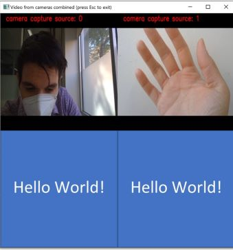
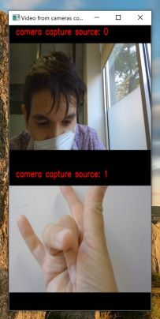
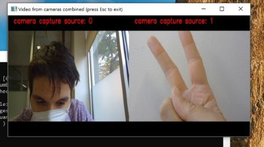
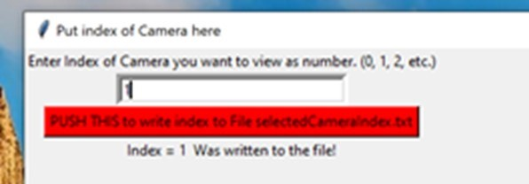
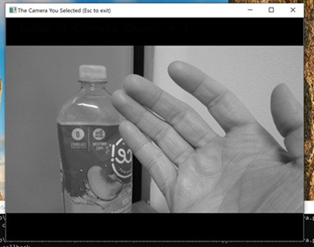

# OpenCV_Various
Variety of OpenCV Codes, scripts, and snippets I made 

# The Directories
## OpenCV_TotalAccess
This directory contains a file called **showAllCameras.py**. This file shows you and your users all cameras that the program can access. It shows you the actual live feed and all associated indices simultaneously. Most importantly it shows the index for each. You know that 0 in cv2.VideoCapture(0)? It shows that. Lets even your users figure out index of each camera with no code, they can find the appropriate index for themselves that you can have them write into a txt file that you call from. Far more convenient than having them reset default webcam or adjusting it in code each time.  

### To Run 
in terminal:

_pip install requirements.txt_    (skip this step if you already have recent versions of numpy and opencv-python, its just those 2 libraries. Works on current versions of those libraries as of May 2021)

_python showAllCameras.py_

And that's it! You can adjust parameters such as font used and image size (in resized_dimensions variable). **Lines 187-189 let you choose the display option between vertical, horizontal, and square (see demo pics below).**

Indices are given in the bit of red text, may be too small here but is clear in the program. 

square display with pic1.jpg as filler, can replace with a logo or whatever or just leave blank. Square mostly usefule for large sets of cameras. ie if you have 100 camera feeds you can cram it into a 10x10. Method we used to combine images required dimension parity, so you can't make them in a rectangle, only a square. (Could adjust code but square with filler works well enough for me. You can see that, since i only have 2 cameras on this device 2^2 = 4 > 2 > 1 = 1^2 so it rounds up to the nearest perfect square and gives us 2 filler images. 

Vertical & Horizontal
 

### Apply the index
I included a tkinter app to help the least technical of people apply the index correctly. While this walkthrough will be in code, tkinter apps can be easily turn into exe's via pyinstaller. Note that all the app does is change the number in the txt file selectedCameraIndex.txt So just edit that if you so choose. But made to be streamlined for rapid actual deployment. 

Simply run the tkinter app in console using _python tkinterEnterIndex.py_ to open the tkinter app:

Finally lets see the camera selected by the tkinter app using _python showSelectedCamera.py_

Here I selected camera 1, ie my 2nd laptop camera facing behind my screen. I also applied a grayscale operation as a bit of a placeholder function. Change to whatever function you want to apply, or none at all.  

### Notes 
Obviously programs accessing all your cameras is a bit of a no-no so your antivirus may block access. Use responsibly. 

If you have a lot of cameras you may get FPS drops and lag. 
